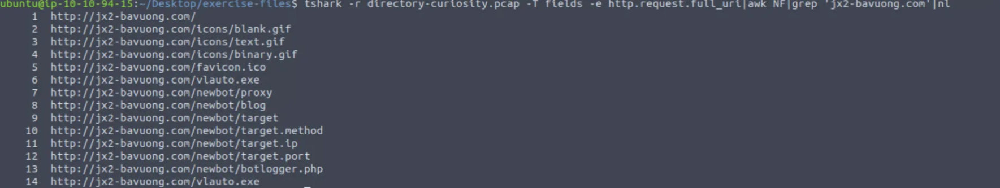

### What is the IP address associated with the malicious domain?

--- 

### What is the server info of the suspicious domain?

---

### What is the total number of HTTP requests sent to the malicious domain?

--- 

### What is the SHA256 value of the malicious file?
I show this on the "docs" folders, basically use "sha256sum" and the path of the file to obtain the hash for the answer.

---

### What is the “PEiD packer” value?
Go to Virustotal, put the hash to analyze and check in Details -> PEiD Packer.

---

### What does the “Lastline Sandbox” flag this as?
Continue on VirusTotal and search for the Lastline sandbox.

